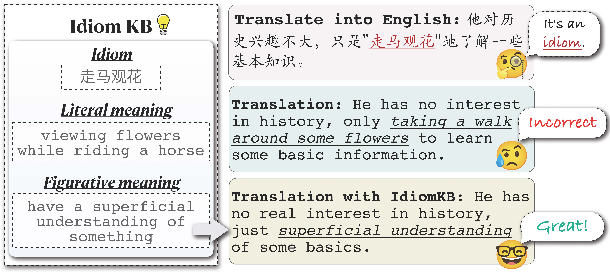

# IdiomKB



Resources for our AAAI 2024 paper: *Translate Meanings, Not Just Words: IdiomKB's Role in Optimizing Idiomatic Translation with Language Models*

## Dataset Format

The dataset comprises three JSON files, each containing idioms and their corresponding meanings for a specific language:

- `en_idiom_meaning.json`: For English idioms
- `zh_idiom_meaning.json`: For Chinese idioms
- `ja_idiom_meaning.json`: For Japanese idioms

Each data entry in the JSON file is a JSON object containing the following fields:

- `id`: A unique integer identifier for the idiom
- `idiom`: The idiom in the corresponding language
- `en_meaning`: The English meaning of the idiom
- `zh_meaning`: The Chinese meaning of the idiom
- `ja_meaning`: The Japanese meaning of the idiom

### Example Data Entry

Here's an example data entry from `zh_idiom_meaning.json`:
```json
{
	"id": 862,
	"idiom": "厝火积薪",
	"en_meaning": "to accumulate anger or resentment",
	"zh_meaning": "比喻积累了许多危险因素而暗藏着许多麻烦或祸害",
	"ja_meaning": "問題が蓄積され、いつか大きなトラブルになる可能性がある"
}
```

## Data Generation Details
The method for constructing IdiomKB is detailed in Section 3.1 of the paper titled "IdiomKB Construction: Knowledge Distillation from LLMs". The data in this repository was generated by OpenAI's gpt-3.5-turbo-0613 model, so there may be errors.


## Citation

We kindly request that you cite our paper if you use this repository. If you have any questions or need further information, please do not hesitate to [contact us](mailto:lishuang18@fudan.edu.cn)!

```latex
@misc{li2023translate,
      title={Translate Meanings, Not Just Words: IdiomKB's Role in Optimizing Idiomatic Translation with Language Models}, 
      author={Shuang Li and Jiangjie Chen and Siyu Yuan and Xinyi Wu and Hao Yang and Shimin Tao and Yanghua Xiao},
      year={2023},
      eprint={2308.13961},
      archivePrefix={arXiv},
      primaryClass={cs.CL}
}
```
